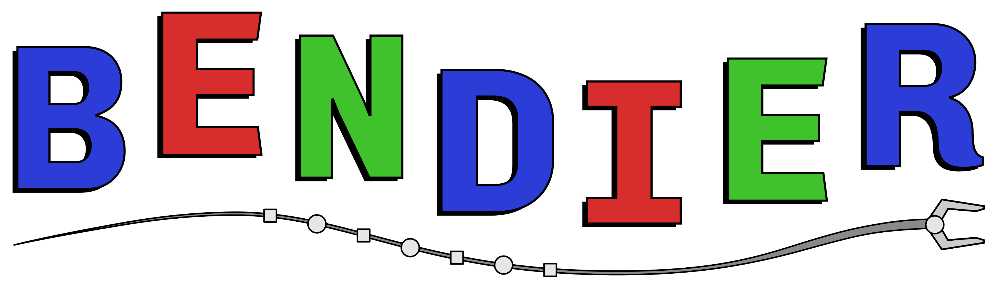
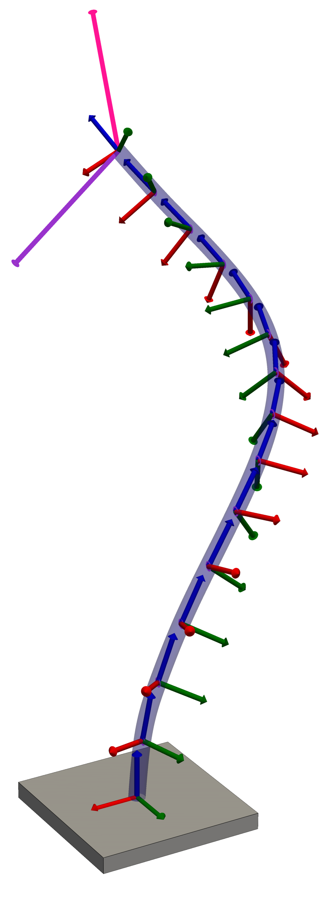
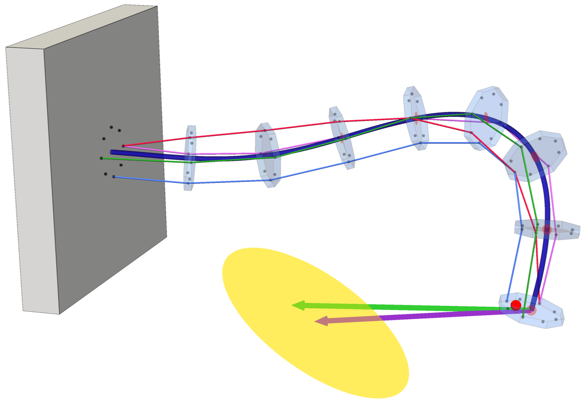
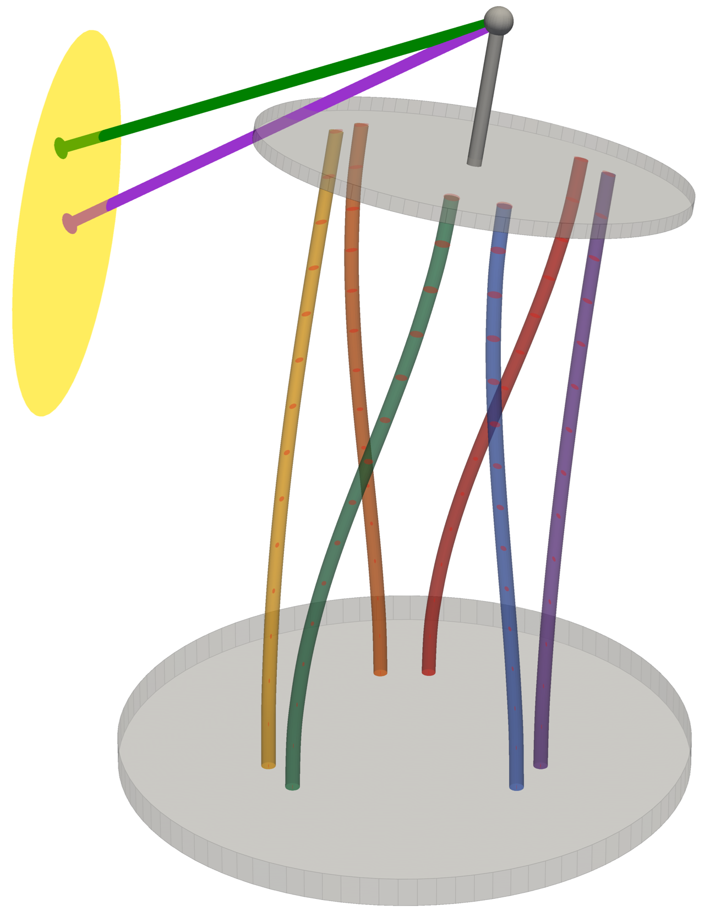

<p align="center">
  
</p>

<h3 align="center">Bayesian Estimation of Nonlinear Deformation: Inference for Elastic Robots</h3>

# Description

Continuum robot state estimation can be formulated similarly to SLAM, where variables are connected through spatial motion priors and measurement factors.
This repository demonstrates how to construct factor graph representations of conditional distributions over robot configurations.

We leverage the sparse nonlinear optimization capabilities of GTSAM for sparse nonlinear optimization.
The repository supports:
- `bendier_solvers`: A standalone static C++ library implementing factor graph optimization methods
- `bendier`: Python package that bundles solver bindings and `viser` visualization under one import

If you use this code, please cite our RAL paper (preprint [here](https://arxiv.org/abs/2601.04493)):

```
@article{ferguson2026continuum,
  title   = {Continuum Robot State Estimation with Actuation Uncertainty},
  author  = {Ferguson, James M. and Kuntz, Alan and Hermans, Tucker},
  journal = {IEEE Robotics and Automation Letters},
  year={2026},
  volume={11},
  number={8},
  pages={9487-9494},
  doi={10.1109/LRA.2026.3703250}
}
```

> **Note:** This repository is under active development and `main` may diverge from the exact code used to produce the RAL paper results. The paper's version is preserved under its own git tag `RAL`.

## C++ Architecture

We designed the C++ architecture to be modular and extensible, so that new robot models can be added with minimal effort and can be composed out of existing models.
For example, `ParallelRobotModel` is a composition of `CosseratRodModel` rods with distal platform constraint factors.
Robot models follow a two-layer model/solver design:

**Model layer** -- internal physics constraints only, no per-solve inputs.
Each model satisfies the `BendierModel<T>` concept, exposing `build_graph()`, `get_initial_values()`, and `get_marginals()`.
Models own their GTSAM keys and build the internal factors that encode physical constraints/behavior (e.g., cosserat equations, tendon-routing wrenches, platform coupling, etc.).
On its own, a model's `build_graph()` output is generally under-constrained -- it is unaware of per-solve actuation inputs or measurements, which are the solver's responsibility.

**Solver layer** -- per-solve priors and measurements.
`SolverBase<ModelType>` is templated on the model type, owns `model_`, and provides a protected, timed `run_solve()` pipeline.
Concrete solvers (e.g. `CosseratRodSolver`) push any per-call geometry (rod lengths, insertion depths, nominal strain) into the model first, build their own priors/measurements as a `gtsam::NonlinearFactorGraph` in `solve()`, then pass that graph to `run_solve()`, which calls `model_.build_graph()` to add the physics factors and finally runs the GTSAM optimizer on the overall graph.
This is also where a model becomes well-posed: the solver must constrain every degree of freedom the model leaves free (e.g. a rigid-body pose anchor, a boundary wrench/tip load, actuation inputs).

## Supported Robot Models

<table align="center">
<tr>
<td align="center">
  <a href="images/cosserat_rod.png"></a>
  <br><sub><b>Cosserat rod</b></sub>
</td>
<td align="center">
  <a href="images/tendon_robot.png"></a>
  <br><sub><b>Tendon-driven robot tip force estimation</b></sub>
</td>
<td align="center">
  <a href="images/parallel_robot.png"></a>
  <br><sub><b>Parallel robot force estimation</b></sub>
</td>
</tr>
</table>

### Model classes

| Model class | Description |
|---|---|
| `CosseratRodModel` | Single elastic rod discretized into `num_nodes` nodes along its arclength. Each node carries a pose, internal wrench (world frame), and optionally an external wrench (world frame) variable. Variables are physically constrained by the discrete Cosserat rod equations. |
| `TendonRobotModel` | A `CosseratRodModel` backbone with tendon-routing discs and tendon tensions variables. Internal physics factors enforce wrench balance equilibrium at each routing disc, given hole locations. Supports optional external wrenches at each node. Note that `num_tendons` is confiugurable at construction. |
| `ParallelRobotModel` | Several `CosseratRodModel` rods connected to a shared platform. Internal physics factors enforce the overall platform wrench balance (including external wrenches), as well as the known offsets between the rod tips and the platform. Note that `num_rods` is configurable at construction. |

### Example Solvers

Each solver wraps a model with a matching set of per-solve priors/measurements, and is the entry point used by the scripts under `python/scripts/` (see [Running Demo Scripts](#running-demo-scripts)).

| Solver class | Always added | Optional, pass to `solve()` |
|---|---|---|
| `CosseratRodSolver` | Fixed base pose prior at node 0. | Tip wrench prior, tip pose prior, and nominal rod strain (defaults to straight rod). |
| `TendonRobotSolver` | Tendon tension prior; a tip wrench prior is always added, defaulting to a small near-zero prior if you don't supply one. | An explicit tip wrench prior (overrides the default); a tip position measurement. |
| `ParallelRobotSolver` | Per-solve rod lengths (actuator commands) and a platform wrench prior. | Per-rod actuation force measurements, for tip force estimation. |

# Building

## Install Eigen3

Eigen is required for numerical linear algebra operations in `bendier` and `gtsam`.
You likely already have it installed, but if not, you can install with:

```bash
sudo apt update
sudo apt install -y libeigen3-dev
```

We have tested with Eigen3 version: **3.4.0**, but others should work as well.

## Install GTSAM

GTSAM is required for factor graph optimization. The best way to install is to build  from source, which ensures that all required dependencies are properly configured.

First clone GTSAM and create a build directory:

```bash
git clone https://github.com/borglab/gtsam.git
cd gtsam
git checkout 4.3a1 # Tested GTSAM version
mkdir build 
cd build
```

Next configure the build with CMake:

```bash
cmake .. -DGTSAM_USE_SYSTEM_EIGEN=ON
```

Use system Eigen for GTSAM (`-DGTSAM_USE_SYSTEM_EIGEN=ON`) so both GTSAM and `bendier` resolve Eigen from the same system installation. 
Maybe not necessary, but avoids mixing GTSAM's internal vendored Eigen headers with the system Eigen headers.

At this point, verify that CMake found all required dependencies (e.g., Boost, Eigen, TBB).
Ensure that there are no critical warnings during configuration.
For more information, see the GTSAM [installation documentation](https://borglab.github.io/gtsam/install/)

If everything looks good, you can now build and install gtsam, which will take several minutes:

```bash
make -j8
sudo make install
```

This installs GTSAM headers (needed to *build* `bendier`) in `/usr/local/include` and library files (needed to *run* `bendier`) in `/usr/local/lib`.

Note that we have tested with the early version of GTSAM: **4.3**.

## Install `bendier` python package

First clone this repository:
```bash
git clone https://github.com/Kuntz-Lab/bendier.git
cd bendier
```

Next create and activate a Python virtual environment:

```bash
python3 -m venv .venv
source .venv/bin/activate
```

Note that we have tested with **Python 3.12.3** but expect that other versions should work as well.

Build and install the `bendier` Python package:

```bash
pip install -e . -v
```

The final output should include `Successfully installed bendier`, meaning that you can now `import bendier` in Python when the virtual environment is active.

## Build C++ library Only

You may want to build the C++ library only (e.g. for real-time ROS integration), which can be done with:

```bash
cmake -S . -B build-cpp -DBENDIER_BUILD_PYTHON=OFF
cmake --build build-cpp -j
cmake --install build-cpp --prefix build-cpp/install
```

This produces a standalone `bendier_solvers` C++ library.
The last line creates a staged install under `build-cpp/install/` that you can copy or point other projects at.

# Running Demos

Plotting utilities live in the `bendier.visualization` package, and runnable examples live in `python/scripts/`.

A handful of simple demo simulations can be run with:

```bash
cd python
bash run_simple_sims.bash
```

All RAL paper simulations can be run with:

```bash
cd python
bash run_ral_sims.bash
```

When the chosen script runs successfully, you can visualize the simulation in `viser` by clicking the link output by the script (e.g. http://localhost:8080).
Your browser will open showing real-time solution geometries for the selected model, as well as solution metadata.

You can also run sever apps to visualize forward and inverse mechanics simulations in real-time:

```bash
python apps/cosserat_rod_forward_sim.py
python apps/tendon_forward_sim.py
python apps/parallel_robot_forward_sim.py
```

These apps have sliders to control inputs, as well as draggable 3D frames to control the robot's base pose and tip pose for inverse mechanics visulaization. 
Note that these can also be run from other machines that can reach the host machine, just by directly visiting the host machine's IP address and port.

## Debugging Tips

1. You may get something like: `ImportError: libgtsam.so.4: cannot open shared object file: No such file or directory`.
This indicates that the GTSAM library installation directory is not visible to the dynamic linker.
In most cases this can be resolved by running `sudo ldconfig` and then rerunning the script.

2. If plotting is slow, first check which GPU is actually rendering OpenGL. On Ubuntu this is usually the most useful single command:

```bash
glxinfo -B
```

Look for `OpenGL vendor string` and `OpenGL renderer string`:
- `llvmpipe`, `softpipe`, or `OSMesa` means software rendering.
- `Intel` means the integrated GPU is active.
- `NVIDIA` means the discrete NVIDIA GPU is active.

To switch the machine to NVIDIA system-wide (careful!), use PRIME Select and reboot:

```bash
sudo prime-select nvidia
sudo reboot
```

If you do not want to change the whole session, you can run like this to select the GPU on a per-command basis:

```bash
__NV_PRIME_RENDER_OFFLOAD=1 __GLX_VENDOR_LIBRARY_NAME=nvidia python scripts/parallel_robot/test_simple.py
```
